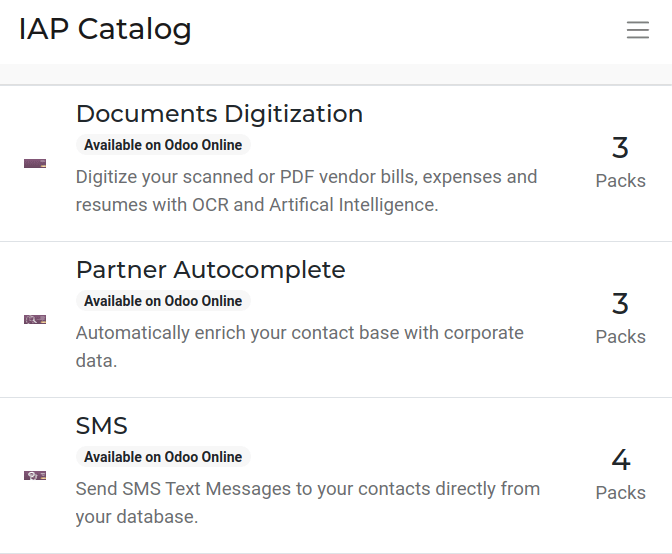

=====================
In-app purchase (IAP)
=====================

In-app purchases (IAP) are optional services that enhance Odoo databases. For example, the **SMS**
service sends text messages to contacts directly from the database, and the **Documents
Digitization** service digitizes scanned or PDF vendor bills, expenses, and resumes with optical
character recognition (OCR) and artificial intelligence (AI).

IAP services do not need to be configured or set up, but each service requires its own prepaid
credits. Each service has its own pricing and pack options listed on the `Odoo IAP website
<https://iap.odoo.com/iap/all-in-app-services>`_, and Odoo users need to :ref:`buy more credits
<iap/buying_credits>` when they run out, in order to keep using the service.

.. tip::
   Users with an Enterprise version of Odoo Online get free credits to test IAP features.

.. _in_app_purchase/portal:

IAP services
============

The `Odoo IAP website <https://iap.odoo.com/iap/all-in-app-services>`_ lists all IAP services
currently available, which include:

- :guilabel:`Documents Digitization`: digitizes scanned or PDF vendor bills, expenses, and resumes
  with OCR and AI.
- :guilabel:`Lead Generation`: generates leads based on a set of criteria and converts web visitors
  into quality leads and opportunities.
- :guilabel:`Partner Autocomplete`: automatically populates contact records with corporate data.
- :guilabel:`SMS`: sends SMS text messages to contacts directly from the database.
- :guilabel:`Snailmail`: sends customer invoices and follow-up reports by post, worldwide.

Use a service
-------------

IAP services are automatically integrated with Odoo and do not require users to configure any
settings. To use a service, simply interact with it wherever it appears in the database.

.. example::
   In this example, the SMS service is used from a contact's record.

   .. image:: in_app_purchase/sms-icon.png
      :align: center
      :alt: Hover the mouse to the right of a contact's phone number to reveal the SMS phone icon.

   1. Navigate to the *Contacts* application and click on a contact that has a phone or mobile
      number.
   2. Hover the mouse over the :guilabel:`Phone` or :guilabel:`Mobile` field and a :guilabel:`📱
      (phone) SMS` icon appears.
   3. Click the :guilabel:`📱 (phone) SMS` icon and a :guilabel:`Send SMS Text Message` pop-up
      appears.

   .. image:: in_app_purchase/send-sms.png
      :align: center
      :alt: The Send SMS Text Message service can be accessed from a contact's record.

   4. Type a message in the :guilabel:`Send SMS Text Message` pop-up, then click :guilabel:`Send
      SMS`. Odoo sends the message via SMS and log what was sent in the chatter.

   The prepaid credits for the SMS service are automatically deducted from the existing pool. If
   there are not enough credits to send the message, Odoo prompts the purchase of more.

.. seealso::
   For more information on how to use various IAP services, review the documentation below:

   - :doc:`Lead mining </applications/sales/crm/acquire_leads/lead_mining>`
   - :doc:`Enrich your contacts base with Partner Autocomplete
     </applications/sales/crm/optimize/partner_autocomplete>`
   - :doc:`SMS essentials </applications/marketing/sms_marketing/essentials/sms_essentials>`

.. _in_app_purchase/credits:

IAP credits
===========

Every time an IAP service is used, the prepaid credits for that service are spent. Odoo prompts the
purchase of more credits when there are not enough credits to continue using the service. Email
alerts can also be set up for when :ref:`credits are low <in_app_purchase/low-credits>`.

Credits are purchased in "packs" from the `Odoo IAP website
<https://iap.odoo.com/iap/all-in-app-services>`_, and pricing is specific to each service.

.. example::
   The `SMS service <https://iap.odoo.com/iap/in-app-services/1>`_ has four packs available, in
   denominations of:

   - **10** credits
   - **100** credits
   - **500** credits
   - **1,000** credits

   The number of credits consumed depends on the length of the SMS and the country of destination.
   For more information, refer to the :doc:`SMS Pricing and FAQ
   </applications/marketing/sms_marketing/pricing/pricing_and_faq>` documentation.

.. _iap/buying_credits:

Buy credits
-----------

If there are not enough credits to perform a task, the database automatically prompts the purchase
of more credits. Users can check the current balance of credits for each service, and manually
purchase more credits through the service's :guilabel:`Account Information` page.

Manually buy credits
~~~~~~~~~~~~~~~~~~~~

   .. image:: in_app_purchase/view-services.png
      :align: center
      :alt: The Settings app showing the Odoo IAP heading and View My Services button.

#. Go to the *Settings* application.
#. Type `IAP` in the search bar at the top.
#. Click :guilabel:`View My Services`.

   .. image:: in_app_purchase/account-info.png
      :align: center
      :alt: The Account Information page for an IAP service showing the Buy Credit button.

#. The available IAP accounts appear in a list view. Click on the desired IAP account to view the
   :guilabel:`Account Information` page.
#. On the :guilabel:`Account Information` page, click the :guilabel:`Buy Credit` button. A
   :guilabel: `Buy Credits for (IAP Account)` page loads in a new tab.

   .. image:: in_app_purchase/buy-pack.png
      :align: center
      :alt: The SMS service page on IAP.Odoo.com with four packs of credits available for purchase.

#. Click :guilabel:`Buy` on the desired pack of credits, then follow the prompts to enter payment
   details and confirm the order.
#. Once the transaction is complete, the credits are available for use in the database.

.. _in_app_purchase/low-credits:

Low-credit notification
~~~~~~~~~~~~~~~~~~~~~~~

It is possible to be notified when credits are low in order to avoid running out of credits while
performing an In-App Purchases (IAP).

#. Go to the *Settings* application.
#. Type `IAP` in the search bar at the top.
#. Click on :guilabel:`View My Services`.
#. The available IAP accounts appear in a list view. Click on the desired IAP account to view the
   :guilabel:`Account Information` page.

   .. image:: in_app_purchase/low-credits.png
      :align: center
      :alt: Odoo will send an email alert when credits for this service fall below the threshold.

#. On the :guilabel:`Account Information` page, click the :guilabel:`Warn Me` box, and two fields
   appear.
#. In the :guilabel:`Threshold` field, enter an amount. Odoo sends a notification email when the
   balance falls below this amount.
#. In the :guilabel:`Warning Email` field, enter the email address that should receive the
   notification.
