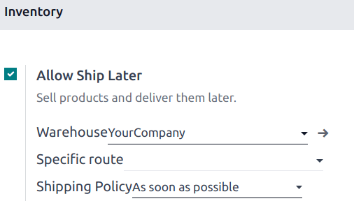

==========
Ship later
==========

The **Ship Later** feature allows you to sell products and schedule delivery at a later date. This
feature comes in handy when a product is out of stock or so voluminous that it requires to be
shipped.

Configuration
=============

Go to the POS settings, scroll down to the :guilabel:`Inventory` section, and enable :guilabel:`Ship
Later`. Once enabled, you can choose the the location from where the products are shipped by
completing the :guilabel:`Warehouse` field, define a specific route, and the shipping policy. Select
:guilabel:`As soon
as possible` if the products can be delivered separately or :guilabel:`When all products are ready`
to ship all the products in one delivery.

.. seealso::
   - :doc:`../../../inventory_and_mrp/inventory/shipping/setup/delivery_method`
   - :doc:`../../../inventory_and_mrp/inventory/management/warehouses/warehouses_locations`

Practical application
=====================

#. :ref:`Open a session <pos/session-start>` and make a sale.
#. On the payment screen, set a customer and select :guilabel:`Ship Later`.
#. On the popup window, set a shipping date and click :guilabel:`Confirm` to proceed to payment.

.. image:: ship_later/payment.png
   :scale: 75%

The system instantly creates a delivery order from the warehouse to the shipping address.

.. Note::
   The selected customer must have referenced an address in the system for products to be shipped.
