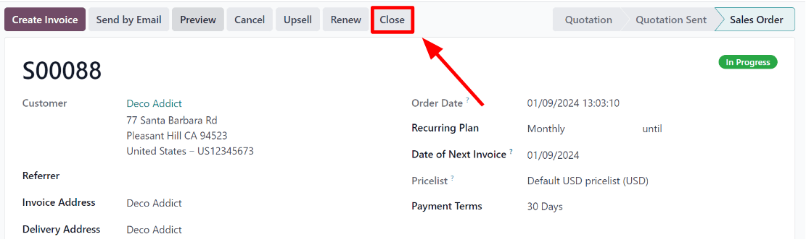

===================
Close subscriptions
===================

Losing a customer isn't ideal, but it's an inevitable outcome of any business. Instead of making it
difficult for customers to cut ties with their subscriptions, it's always best to simplify the
process, as that benefits both parties, without any negative impacts or outcomes.

If the subscription closing process is made unnecessarily difficult or cumbersome, that will likely
increase the level dissatisfaction amongst the leaving customer base, which can negatively impact
the reputation of the company.

By allowing customers to have the power to close their own subscriptions, they don't feel "trapped"
and are more likely patronize the same business again in the future for other products, services,
and/or subscriptions.

With Odoo *Subscriptions*, companies are granted the opportunity to choose how they want
subscriptions to close. They can give customers the control to manage their own subscriptions, or
restrict that ability entirely.

Configuration
=============

To properly configure the recurring plans offered, navigate to :menuselection:`Subscriptions app -->
Configuration --> Recurring Plans`. From there, either create a new plan by clicking :guilabel:`New`
or select an existing one to modify it.

Once on the :guilabel:`Recurring Plans` form, check the box beside :guilabel:`Closable`, in the
:guilabel:`Self-Service` section, to allow customers to close their own subscriptions using the
customer portal.

.. image:: closing/recurring-plans-closable-option.png
  :align: center
  :alt: The Closable option on a recurring plan form in Odoo Subscriptions.

.. note::
   Check out our documentation on :doc:`subscription plans <plans>` for more information on how to
   configure recurring plans.

Close a subscription
====================

Administrator view
------------------

After a quotation for a subscription product(s) has been confirmed, it becomes a sales order, and
the subscription is officially :guilabel:`In Progress`.

At that point, the ability to close the subscription becomes available, via the :guilabel:`Close`
button at the top of the :guilabel:`In Progress` subscription order. This option is also available
after the order has been invoiced and the payment has been registered.

When the :guilabel:`Close` button is clicked, a :guilabel:`Close Reason` pop-up window appears. In
this pop-up window, enter the reason for closing the subscription or select an option from the
drop-down menu of options that appears when the :guilabel:`Reason` field is clicked.

.. image:: closing/close-reason-popup.png
  :align: center
  :alt: The Close Reason pop-up that appears when the Close button is clicked in Odoo Subscriptions.

When the desired :guilabel:`Reason` is entered, click the :guilabel:`Submit` button.

Upon clicking :guilabel:`Submit` on the :guilabel:`Close Reason` pop-up window, the pop-up window
disappears, and the subscription sales order has a :guilabel:`Churned` status tag, along with the
specified :guilabel:`Close Reason`.

.. image:: closing/churned-sales-order.png
  :align: center
  :alt: A churned sales order for a closed subscription in Odoo Subscriptions.

That same close reason can be found in the *Chatter* of the sales order, as well.

.. image:: closing/churned-sales-order-chatter.png
  :align: center
  :alt: The chatter of a churned sales order for a closed subscription in Odoo Subscriptions.

Customer view
-------------

.. note::
  As an administrator, the ability to visualize what customers see when managing their subscriptions
  is accessible via the :guilabel:`Preview` button, located at the top of the subscription sales
  order.

From the customer's point of view, in the customer portal, the :guilabel:`Close Subscription` button
is located on the left side of the sales order.

.. image:: closing/close-subscription-button-customer-view.png
  :align: center
  :alt: Close subscription button on a customer's view of a sales order in Odoo Subscriptions.

When the customer clicks the :guilabel:`Close Subscription` button, a :guilabel:`Close Subscription`
pop-up window appears, in which the customer has to choose from a select list of reasons why they
are choosing to close the subscription.

.. image:: closing/close-subscription-customer-pov.png
  :align: center
  :alt: The close subscription pop-up window customers see when closing a subscription.

.. note::
  Customers can *only* chose a pre-configured reason why the subscription is being closed. They can
  *not* enter a custom reason from the customer portal.

Once the customer has chosen a close reason, they would click the :guilabel:`Submit` button on the
pop-up window.

When the subscription has been closed, a :guilabel:`Closed` tag is applied to the subscription order
in the customer portal.

In addition, the specified :guilabel:`Close Reason` appears on the subscription order in the
*Subscriptions* app in the backend (Administrator's view).

.. seealso::
   - :doc:`../subscriptions`
   - :doc:`plans`
   - :doc:`products`
