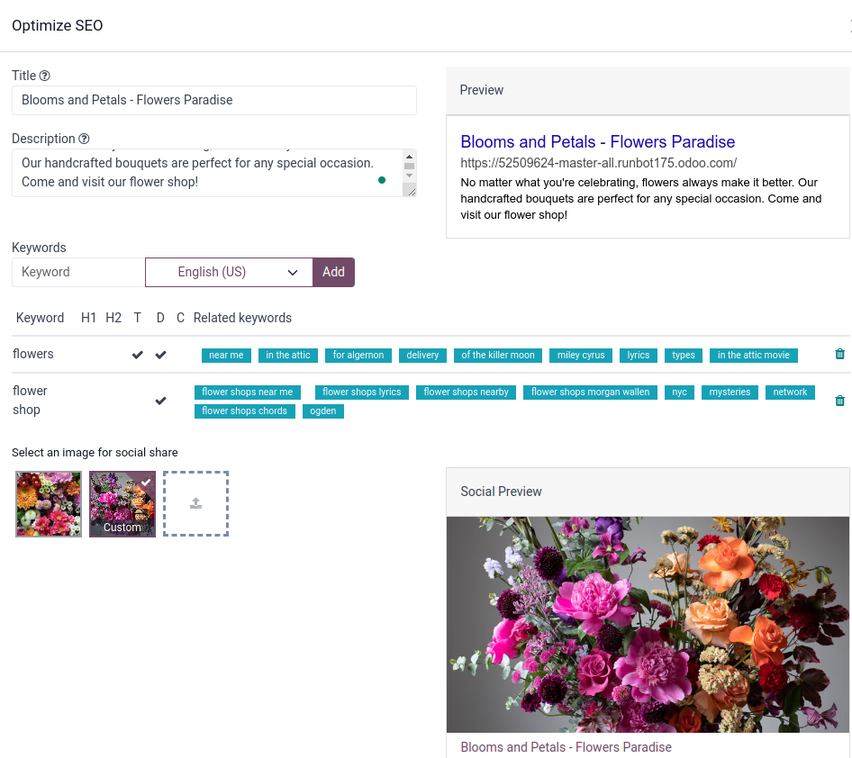
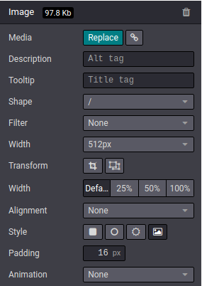

================================
Search Engine Optimization (SEO)
================================

Search Engine Optimization, often abbreviated as SEO, is a digital marketing strategy aimed at
improving a website's visibility and ranking in search engine results like Google. It involves
optimizing various elements on a website, including your content, social sharing, URLs, images, and
page speed.

.. note::
   Odoo provides several modules to help you build your website content such as :doc:`eCommerce <../../ecommerce>`,
   Blog, :doc:`eLearning <../../elearning>`, and :doc:`Forum <../../forum>`.

.. Tip::
   Use `woorank <https://www.woorank.com>`_ free services to compare how your website ranks in terms
   of SEO.

Content optimization
====================

In Odoo, you can **Optimize SEO** by going to :menuselection:`Website --> Site --> This page:
Optimize SEO`.



Meta tags
---------

Meta tags are HTML elements that provide information about a webpage to search engines and website
visitors. They play a crucial role in SEO by helping search engines understand the content and
context of a webpage.

:guilabel:`Title` tags specify the title of a webpage and is displayed as the clickable link in
search engine results. It should be concise, descriptive, and relevant to the page's content. You
can update the title tag of your webpage or keep it empty to use the default value.

:guilabel:`Description` tags provide a brief summary of the webpage's content, often displayed in
search engine results below the title. It is essential for encouraging click-throughs. You can
update the description tag of your webpage or keep it empty to use the default value based on the
page’s content.

.. note::
   The :guilabel:`Preview` card gives an overview of how the title and description tags you entered
   appear in search results. It also includes the URL of your page.

Keywords
--------

Odoo provides a ``<keyword>`` finder to help you write quality content and boost your traffic. Those
keywords are the searches you want to head toward your website. You can see for each keyword you
enter how it is used in the content under :guilabel:`H1`, :guilabel:`H2`, :guilabel:`T` for page
title, :guilabel:`D` for page description, and :guilabel:`C` for page content) and suggested
keywords you can add to your page to boost your SEO. The more keywords are used, the better.

Image for social share
----------------------

Select an image for social share. By default, your logo image is selected, but you can upload any
other image you want by clicking on the upward arrow.

.. Note::
   The :guilabel:`Social Preview` card gives an overview of how your information would appear when
   shared.

Social networks
---------------

Social media and SEO can complement each other by driving traffic and enhancing online visibility.
Sharing content can improve SEO by increasing inbound links and engagement. Odoo embeds several
tools to share content through social media.

Social share
~~~~~~~~~~~~

You can add your media icons on any page of your website to invite users to share it on their social
media. To do so, click :guilabel:`Edit`, go to the :guilabel:`Blocks` tab, :guilabel:`Inner` content
section, and drop the building block :guilabel:`Share`.

.. Tip::
   You can refer to your social media in your website footer. From your website, click
   :guilabel:`Edit`, go to :guilabel:`Customize` tab, and scroll to the :guilabel:`Social Media`
   section. Add the link to your social networks and toggle the switch.

   .. image:: seo/connectwithus.png
      :alt: Connect with us through social media

Facebook page
~~~~~~~~~~~~~

From your website, click :guilabel:`Edit`, go to the :guilabel:`Blocks` tab, go to the
:guilabel:`Dynamic Content` section, and drop the :guilabel:`Facebook` building block to display a
widget of your Facebook business page and encourage visitors to follow it. You can display the
timeline, the next events, and the messages.

Multi-language URLs
===================

Your website is displayed in the language that matches the visitor’s browser’s language unless that
particular language has not been installed. In this case, the website is displayed in the default
language. The visitor can still select another language in the language menu. When a website is run
in multiple languages, the same content is available in different URLs, depending on the language
used:

- https://www.mywebsite.com/shop/product/my-product-1 (main language, English here)

- https://www.mywebsite.com/fr_FR/shop/product/mon-produit-1 (French version)

In this example, fr_FR is the language of the page.

.. seealso::
   Translation

.. tip::
   To ensure visitors see the default language, use a link with the default language code, like
   "yourwebsite.com/en_US/shop." This way, visitors consistently view the English version,
   regardless of their browser settings.

Page speed
==========

The time to load a page is an important criterion for search engines. Odoo uses different ways to
speed up your page loading time.

.. tip::
   Compare how your website ranks using Google Page Speed or Pingdom Website Speed Test.

Images
------

Odoo automatically compresses images you download to reduce their sizes (lossless compression for
.PNG and .GIF and lossy compression for .JPG). All images used in Odoo official themes have been
compressed by default. If you are using a third-party theme, it may provide images that are not
compressed efficiently. To modify an image from your website, select it, go to the website builder,
and to the Customize tab, Image section. Filling the Alt tag is important from an SEO perspective.
It provides information regarding your image, and the the description you enter appears when the
image cannot be displayed.



To replace a media, click Replace. A pop-up appears.

- Images tab: search for an Unsplash image, Add url or upload an image;
- Documents tab: Search a document, add document, or upload a document;
- Icons tab: Search for a pictogram. You can use as many icons as you want; they do not result in
  extra requests to load the page.

Responsive design
-----------------

All Odoo themes rely on Bootstrap to render efficiently according to the device: desktop, tablet, or
mobile, which positively impacts ranking in search engines.

.. image:: seo/design.png
  :align: center

Search engines files
====================

Sitemap
-------

The sitemap points out pages to index to search engine robots. Odoo generates a /sitemap.xml file
automatically for you. For performance reasons, this file is cached and updated every 12 hours. By
default, URLs are in a single /sitemap.xml file, but if you have a lot of pages, Odoo automatically
creates a Sitemap Index file, respecting the sitemaps.org protocol grouping sitemap URL’s in 45000
chunks per file. Every sitemap entry has three attributes that are computed automatically:

- <loc> : the URL of a page
- <lastmod> : last modification date of the resource, computed automatically based on related
  object. For a page related to a product, this could be the last modification date of the product
  or the page.
- <priority> : modules may implement their own priority algorithm based on their content (example: a
  forum might assign a priority based on the number of votes on a specific post). The priority of a
  static page is defined by it’s priority field, which is normalized (16 is the default).

Structured data markup
----------------------

Structured data markup is used to generate rich snippets in search engine results. It is a way for
website owners to send structured data to search engine robots; helping them understand your content
and create well-presented search results.

Google supports a number of rich snippets for content types, including: Reviews, People, Products,
Businesses, Events and Organizations.

Odoo implements micro data as defined in the schema.org specification for events, eCommerce
products, forum posts and contact addresses. This allows your product pages to be displayed in
Google using extra information like the price and rating of a product:

.. image::

robots.txt
----------

When indexing your website, search engines take a first look at the general indexing rules of the
/robots.txt file (allowed robots, sitemap path, etc.). Odoo automatically creates it. Its content
is:

User-agent: * Sitemap: https://www.odoo.com/sitemap.xml

It means that all robots are allowed to index your website and there is no other indexing rule than
specified in the sitemap to be found at following address. You can customize the file robots in
developer mode from Settings –> Technical –> User Interface: Views (exclude robots, exclude some
pages, redirect to a custom Sitemap). Make the Model Data of the view Non Updatable to not reset the
file after system upgrades.


---------------------------------------------------------------------------------------------------

Meta Tags
=========

Title, Description
------------------

Every web page should define the ``<title>`` and ``<description>`` meta data.
These information elements are used by search engines to promote your website.
They are automatically generated based on page title & content, but you can
finetune them. Make sure they fit the content of the page, otherwise you will
be downgraded by search engines.

.. image:: seo/seo01.png
   :align: center

Keywords
--------

In order to write quality content and boost your traffic, Odoo provides
a ``<keyword>`` finder. Those keywords are the searches you want to head
towards your website. For each keyword, you see how it is used in the content
(H1, H2, page title, page description, page content) and what are the related
searches in Google. The more keywords are used the better.

.. image:: seo/seo02.png
   :align: center

.. note::
  If your website is in multiple languages, you can use the Promote
  tool for every language of a single page and set specific title,
  description and search tags.


Use Social Networks
===================

Social media is built for mass sharing. If lots of people share your content
on social media, then it's likely more people will link to it,
and links are a huge factor for SEO ranking.

Odoo embeds several tools to share content through social media:

Social Network
--------------

Odoo allows to link all your social network accounts in your website footer.
All you have to do is to refer all your accounts in your company settings.

.. image:: seo/seo03.png
   :align: center

Social Share
------------

Drop the building block *Share* on any page you want your visitors to share.
By clicking the icon, they are prompted to share the page in their social media
wall.

.. image:: seo/seo04.png
   :align: center

Most social media use a picture of the picture to decorate the share post.
Odoo uses the website logo by default but you can choose any other image
of your page in the Promote tool.

.. image:: seo/seo05.png
   :align: center

Facebook Page
-------------

Drop the building block *Facebook Page* to display a widget of your Facebook
business page and encourage visitors to follow it.
You can display the timeline, the next events and the messages.

Twitter Scroller
----------------

Display the Twitter feeds with customer satifaction on your website.
This will increase the number of tweets and shares.

Test Your Website
=================

You can compare how your website rank, in terms of SEO, against Odoo
using WooRank free services:
`woorank.com <https://www.woorank.com>`_


Multi-Language Support
======================

.. _seo-multilanguage:

Multi-Language URLs
-------------------

If you run a website in multiple languages, the same content will be
available in different URLs, depending on the language used:

- https://www.mywebsite.com/shop/product/my-product-1 (main language, English here)

- https://www.mywebsite.com\/fr\_FR/shop/product/mon-produit-1 (French version)

In this example, fr\_FR is the language of the page. You can even have
several variations of the same language: pt\_BR (Portuguese from Brazil)
, pt\_PT (Portuguese from Portugal).

Language Annotation
-------------------

To let search engines know that the second URL is the French translation of the
first URL, Odoo will add an HTML link element in the header. In the HTML
<head> section of the main version, Odoo automatically adds a link
element pointing to the translated versions of that webpage;

-  <link rel="alternate" hreflang="fr"
   href="https://www.mywebsite.com\/fr\_FR/shop/product/mon-produit-1"/>

With this approach:

- Search engines will redirect to the right language according to the
  visitor language.

- You do not get penalized by search engines if your page is not translated
  yet. Indeed, it's not a duplicated content, but a different
  version of the same content.

Language Detection
------------------

When a visitor lands for the first time on your website (e.g.
yourwebsite.com/shop), they may automatically be redirected to a
translated version according to their browser language preference (e.g.
yourwebsite.com/fr\_FR/shop).

Next time, it keeps a cookie of the current language to
avoid any redirection.

To force a visitor to stick to the default language, you can use the
code of the default language in your link, example:
yourwebsite.com/en\_US/shop. This will always land visitors to the
English version of the page, without using the browser language
preferences.

Page Speed
==========

Introduction
------------

The time to load a page is an important criteria for search engines. A faster
website not only improves your visitor's experience, but gives
you a better page ranking. Some studies have shown that, if you divide the time to
load your pages by two (e.g. 2 seconds instead of 4 seconds), the
visitor abandonment rate is also divided by two. (25% to 12.5%). One
extra second to load a page could `cost $1.6b to Amazon in
sales <http://www.fastcompany.com/1825005/how-one-second-could-cost-amazon-16-billion-sales>`__.

.. image:: seo/seo06.png
  :align: center

Fortunately, Odoo does all the magic for you. Below, you will find the
tricks Odoo uses to speed up your page loading time. You can compare how
your website ranks using these two tools:

- `Google Page Speed <https://developers.google.com/speed/pagespeed/insights/>`__

- `Pingdom Website Speed Test <http://tools.pingdom.com/fpt/>`__

Images
------

When you upload new images, Odoo automatically
compresses them to reduce their sizes (lossless compression for .PNG
and .GIF and lossy compression for .JPG).

From the upload button, you have the option to keep the original image
unmodified if you prefer to optimize the quality of the image rather
than performance.

.. image:: seo/seo07.png
  :align: center

.. note::
  Odoo compresses images when they are uploaded to your website, not
  when requested by the visitor. Thus, it's possible that, if you use a
  third-party theme, it will provide images that are not compressed
  efficiently. But all images used in Odoo official themes have been
  compressed by default.

When you click on an image, Odoo shows you the Alt and title attributes
of the ```` tag. You can click on it to set your own title and Alt
attributes for the image.

.. image:: seo/seo08.png
  :align: center

When you click on this link, the following window will appear:

.. image:: seo/seo09.png
  :align: center

Odoo's pictograms are implemented using a font (`Font
Awesome <https://fortawesome.github.io/Font-Awesome/icons/>`__ in most
Odoo themes). Thus, you can use as many pictograms as you want in your
page, they will not result in extra requests to load the page.

.. image:: seo/seo10.png
  :align: center


Scalability
-----------

In addition to being fast, Odoo is also more scalable than traditional
CMS and eCommerce (Drupal, Wordpress, Magento, Prestashop).

Here is the slide that summarizes the scalability of Odoo Website & eCommerce.

.. image:: seo/seo13.png
   :align: center

Search Engines Files
====================

Sitemap
-------

The sitemap points out pages to index to search engine robots.
Odoo generates a ``/sitemap.xml`` file automatically for you. For
performance reasons, this file is cached and updated every 12 hours.

By default, all URLs will be in a single ``/sitemap.xml`` file, but if you
have a lot of pages, Odoo will automatically create a Sitemap Index
file, respecting the `sitemaps.org
protocol <http://www.sitemaps.org/protocol.html>`__ grouping sitemap
URL's in 45000 chunks per file.

Every sitemap entry has 4 attributes that are computed automatically:

-  ``<loc>`` : the URL of a page

-  ``<lastmod>`` : last modification date of the resource, computed
   automatically based on related object. For a page related to a
   product, this could be the last modification date of the product
   or the page.

-  ``<priority>`` : modules may implement their own priority algorithm based
   on their content (example: a forum might assign a priority based
   on the number of votes on a specific post). The priority of a
   static page is defined by it's priority field, which is
   normalized (16 is the default).

Structured Data Markup
----------------------

Structured Data Markup is used to generate Rich Snippets in search
engine results. It is a way for website owners to send structured data
to search engine robots; helping them understand your content and
create well-presented search results.

Google supports a number of rich snippets for content types, including:
Reviews, People, Products, Businesses, Events and Organizations.

Odoo implements micro data as defined in the
`schema.org <http://schema.org>`__ specification for events, eCommerce
products, forum posts and contact addresses. This allows your product
pages to be displayed in Google using extra information like the price
and rating of a product:

.. image:: seo/seo14.png
   :align: center

robots.txt
----------

When indexing your website, search engines take a first look at the
general indexing rules of the ``/robots.txt`` file (allowed robots,
sitemap path, etc.). Odoo automatically creates it. Its content is:

User-agent: \*
Sitemap: https://www.odoo.com/sitemap.xml

It means that all robots are allowed to index your website
and there is no other indexing rule than specified in the sitemap
to be found at following address.

You can customize the file *robots* in :ref:`developer mode <developer-mode>` from *Settings -->
Technical --> User Interface --> Views* (exclude robots, exclude some pages, redirect to a custom
Sitemap). Make the Model Data of the view *Non Updatable* to not reset the file after system
upgrades.
