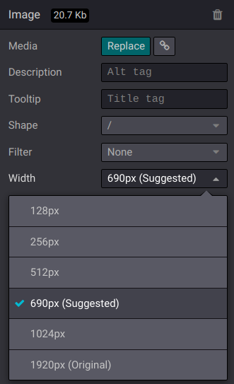
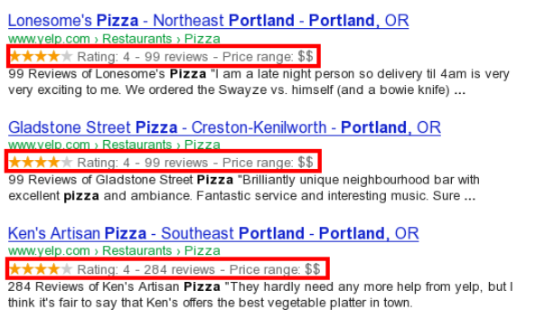
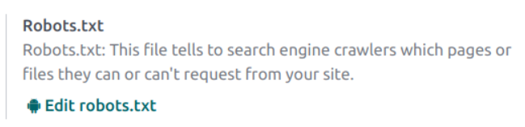

================================
Search Engine Optimization (SEO)
================================

Search Engine Optimization, often abbreviated as SEO, is a digital marketing strategy to improve a
website's visibility and ranking in search engine results (e.g., in Google). It involves optimizing
various elements on a website, including your content, social sharing, URLs, images, and page speed.

.. note::
   Odoo provides several modules to help you build your website content, such as :doc:`eCommerce <../../ecommerce>`,
   :doc:`Blog <../../blog>`, :doc:`eLearning <../../elearning>`, and :doc:`Forum <../../forum>`.

Content optimization
====================

You can **Optimize SEO** by going to :menuselection:`Website --> Site --> This page: Optimize SEO`.

.. image:: seo/bloomsandpetals.png
   :alt: Optimize SEO

Meta tags
---------

Meta tags are HTML elements that provide information about a webpage to search engines and website
visitors. They play a crucial role in SEO by helping search engines understand the content and
context of a webpage and attract visitors with appealing content. There are two types of meta tags
in Odoo:

- :guilabel:`Title` tags specify a webpage's title and are displayed as a clickable link in search
  engine results. It should be concise, descriptive, and relevant to the page's content. You can
  update the title tag of your webpage or keep it empty to use the default value based on the page’s
  content.

- :guilabel:`Description` tags summarize the web page's content, often displayed in search engine
  results below the title. It is essential to encourage the user to visit the page. You can update
  the description tag of your webpage or keep it empty to use the default value based on the page’s
  content.

.. note::
   The :guilabel:`Preview` card overviews how the title and description tags should appear in search
   results. It also includes the URL of your page.

Keywords
--------

Odoo ``<keyword>`` finder helps you see how your keywords are used at the different levels of your
content (H1, H2, page title, page description, page content) and the related searches in Google. The
more keywords are present on your webpage, the better.

.. tip::
   Only one H1 title per page for SEO is strongly recommended.

Image for social share
----------------------

By default, your logo image is selected, but you can upload any other image you want by clicking the
upward arrow.

.. Note::
   - The :guilabel:`Social Preview` card gives an overview of how your information would appear when
     shared.
   - If you change the title of a blog post or the name of a product, the changes apply
     automatically everywhere on your website. The old link still functions when external websites
     use a 301 redirect, maintaining the SEO link juice.

Page speed
==========

The time to load a page is an essential criterion for search engines to optimize SEO ranking. Odoo
uses different ways to speed up your page loading time.

.. tip::
   Compare how your website ranks using `Google Page Speed <https://pagespeed.web.dev/?utm_source=psi&utm_medium=redirect>`_
   or `Pingdom Website Speed Test <https://tools.pingdom.com/>`_

Images
------

Odoo automatically compresses images you download to reduce their weight and speed up the page load
speed. All images used in Odoo official themes are compressed by default. If you are using a
third-party theme, it may provide images that are not compressed efficiently.

**To modify an image** from your website, select it, go to the website builder, :guilabel:`Customize`
tab, :guilabel:`Image` section, and adjust the :guilabel:`width`.

.. important::
   Alt tags are used to describe what’s on your image. Adding alt tags keywords in the
   :guilabel:`Description` field is essential from an SEO perspective. This description is added to
   the HTML code of your image, and it is shown when the image cannot be displayed.

.. note::
   We are cautious about implementing only scalable features. Your website remains fast even if you
   have dozens of thousands of products.

Responsive design
=================

All Odoo themes rely on the CSS Framework `Bootstrap <https://getbootstrap.com/>`_ to render
efficiently according to the device: desktop, tablet, or mobile, which positively impacts ranking in
search engines.

Advanced features
=================

Structured data markup
----------------------

Structured data markup is used to generate rich snippets in search engine results. It is a way for
websites to send structured data to search engine robots, helping them understand your content and
create well-presented search results.

By default, Google supports  many rich snippets for content types, including Reviews, People,
Products, Businesses, Events, and Organizations.

Odoo implements microdata as defined in the schema.org specification for events, eCommerce
products, forum posts, and contact addresses. This allows your product pages to be displayed in
Google using extra information like the price and rating of a product:

robots.txt
----------

When indexing your website, search engines take a first look at the robots.txt file. Odoo
automatically creates one file available on mydatabase.odoo.com/robots.txt.

You can add custom instructions to the file by going to :menuselection:`Configuration -->
Robots.txt: Edit robots.txt`

Sitemap
-------

The sitemap points out website pages and their relation to each other to search engine robots. Odoo
generates a /sitemap.xml file For performance reasons, this file is cached and updated every 12
hours.

All URLs pages are in one /sitemap.xml file. However, if there are many pages, Odoo automatically
creates a Sitemap Index file, respecting the `sitemaps.org protocol <http://www.sitemaps.org/protocol.html>`_
grouping sitemap URLs in 45000 chunks per file.

Every sitemap entry has three attributes that are computed automatically:

- <loc>: the URL of a page
- <lastmod>: last modification date of the resource, computed automatically based on the related
  object. For a page related to a product, this could be the last modification date of the product
  or the page.
- <priority>: modules may implement their priority algorithm based on their content (for example, a
  forum might assign a priority based on the number of votes on a specific post). The priority of a
  static page is defined by its priority field, which is normalized (16 is the default).

.. tip::
   Disabling the “Is indexed” checkbox prevents pages from appearing in a sitemap.

     .. image:: seo/page-properties.png
        :alt:  disabling the “Is indexed” checkbox

Hreflang HTML tags
------------------

Odoo automatically includes hreflang and x-default tags in the code of your website's multilingual
pages. These HTML attributes are crucial in informing search engines about a specific page's
language and geographical targeting. For instance, when someone searches for your page, the
hreflang tag assists the search engine in identifying all language versions of the page.
Additionally, it supports search engines in presenting the most relevant version of your page based
on the user's language and location.
